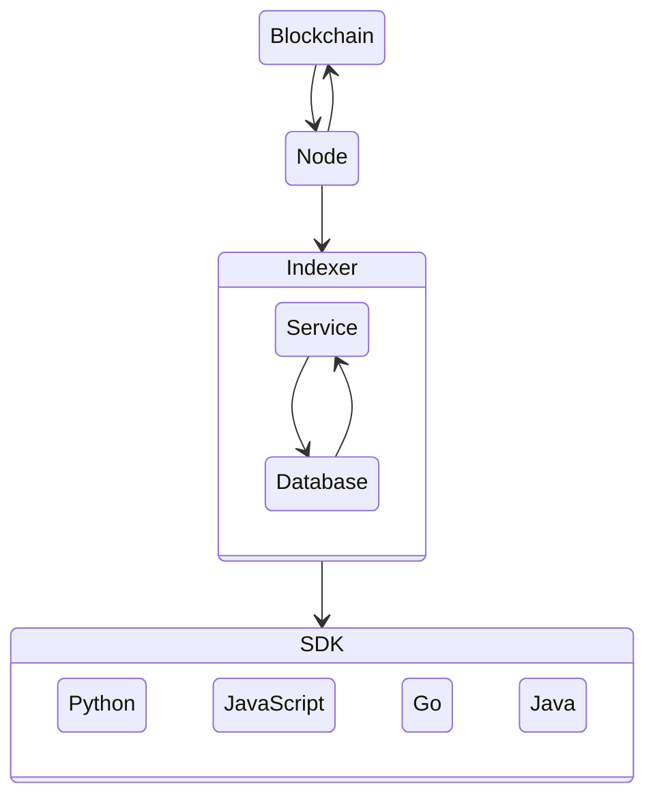

  
  

---

    
    <h1 align="left">Algorand Sandbox</h1>
    <h3 align="left">Block Foundation Docker Containers</h3>

---

    

## Introduction

Welcome to the Block Foundation's Algorand Sandbox Docker Image Repository, your one-stop resource for running an Algorand Sandbox with ease and efficiency.

This repository is an integral part of our mission to harness blockchain technology to empower architects and foster innovative solutions to the housing sector's most pressing challenges.

If you're unfamiliar with it, Algorand Sandbox is a fast, easy way to create and configure an Algorand development environment with all the necessary components. Meanwhile, Docker provides an efficient, reproducible environment to package and distribute software applications. The purpose of this repository is to provide a Docker image designed to facilitate the operation of an Algorand Sandbox.

Our Algorand Sandbox Docker image aims to enhance accessibility, security, and ease-of-use. It features a pre-configured environment that eliminates the need for a manual setup, serving as an ideal resource for developers and blockchain enthusiasts who wish to explore the Algorand network or contribute to its growth by running their own sandbox.

This repository contains detailed instructions on deploying and operating the Docker image, alongside the source code for the image itself. We actively encourage our community to utilize this Docker image, share their experiences, and participate in its ongoing improvement and development.

Our commitment to transparency, shared innovation, and technological democratization is reflected in this initiative. We're excited to offer this resource to you and look forward to seeing how it enhances your engagement with blockchain technology.

Thank you for being a key part of the Block Foundation community. Your involvement is vital in driving our endeavor to revolutionize the architectural and real estate sectors through blockchain technology. Together, we can build a future that is more inclusive, sustainable, and forward-thinking.

## Network

## Resources

### Algorand

- [Algorand](https://www.algorand.com/)
- [Algorand | Developer](https://developer.algorand.org/)

#### Algorand SDK

- [Algorand SDK | Docs](https://py-algorand-sdk.readthedocs.io/en/latest/)
- [Algorand SDK | GitHub](https://github.com/algorand/py-algorand-sdk/)

#### Algorand Go

- [Algorand Go | GitHub](https://github.com/algorand/go-algorand)

#### AlgoDjango
- [AlgoDjango | Tutorial](https://developer.algorand.org/solutions/getting-started-with-python-algorand-sdk-and-django/)
- [AlgoDjango | GitHub](https://github.com/ipaleka/algodjango)

#### Algorand PyTeal

- [Algorand PyTeal](https://github.com/algorand/pyteal)
- [Algorand PyTeal | Utils](https://github.com/algorand/pyteal-utils)
- [Algorand PyTeal | Course](https://github.com/algorand-devrel/pyteal-course)

#### Algorand Sandbox

- [Algorand Sandbox](https://github.com/algorand/sandbox)

## Development

### Authors

This is an open-source project by the **[Block Foundation](https://www.blockfoundation.io "Block Foundation website")**.

The Block Foundation mission is enabling architects to take back initiative and contribute in solving the mismatch in housing through blockchain technology. Therefore the Block Foundation seeks to unschackle the traditional constraints and construct middle ground between rent and the rigidity of traditional mortgages.

website: [www.blockfoundation.io](https://www.blockfoundation.io "Block Foundation website")

### Contributing

We'd love for you to contribute and to make this project even better than it is today!
Please refer to the [contribution guidelines](.github/CONTRIBUTING.md) for information.

## Legal

### Copyright

Copyright &copy; 2023 [Block Foundation](https://www.blockfoundation.io/ "Block Foundation website"). All Rights Reserved.

### License

Except as otherwise noted, the content in this repository is licensed under the
[Creative Commons Attribution 4.0 International (CC BY 4.0) License](https://creativecommons.org/licenses/by/4.0/), and
code samples are licensed under the [MIT License](https://opensource.org/license/mit/).

Also see [LICENSE](https://github.com/block-foundation/community/blob/master/LICENSE) and [LICENSE-CODE](https://github.com/block-foundation/community/blob/master/LICENSE-CODE).

### Disclaimer

**THIS SOFTWARE IS PROVIDED AS IS WITHOUT WARRANTY OF ANY KIND, EITHER EXPRESS OR IMPLIED, INCLUDING ANY IMPLIED WARRANTIES OF FITNESS FOR A PARTICULAR PURPOSE, MERCHANTABILITY, OR NON-INFRINGEMENT.**
